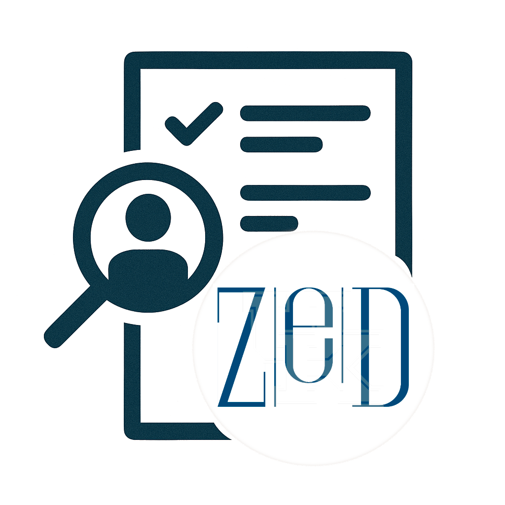

# ZeD Lab — Policies, Onboarding & Skill Tests

Central repository for **lab policies**, **new‑member onboarding**, and **technical screening tasks** for the Zero Knowledge Discovery Laboratory (University of Kentucky).



---

## Table of Contents
- [Overview](#overview)
- [Quick Links](#quick-links)
- [Repository Structure](#repository-structure)
- [Who Should Use What?](#who-should-use-what)
- [Contributing / Updates](#contributing--updates)
- [Contact](#contact)
- [License](#license)

---

## Overview
This repo consolidates all group‑level materials into one place. It now serves as the **general policy hub** for the ZeD Lab:

- Policies that govern lab operations and expectations
- Onboarding steps for accepted members (post‑screening)
- Skill tests used during candidate evaluation

If you are **already accepted**, please start with the **Onboarding** document. If you are a **candidate**, complete the **Skill Tests** assigned to your level.

---

## Quick Links
- **Lab Policies (current)**: [`ZeD_policies.md`](ZeD_policies.md) 
- **Onboarding (post‑acceptance)**: [`onboarding.md`](onboarding.md)
- **Skill Tests**:
  - Level 0 (Undergraduate): [`level_0_screening.md`](level_0_screening.md)
  - Level 1 (Graduate/Postdoc): [`level_1_screening.md`](level_1_screening.md)

---

## Repository Structure
```text
ZeDpolicies/
├─ onboarding.md                # Post‑acceptance setup (Slack, GitHub, MCC/LCC)
├─ ZeD_policies.md              # Lab policies on expectations, requirements etc
├─ level_0_screening.md         # Candidate screening — Level 0
├─ level_1_screening.md         # Candidate screening — Level 1
├─ logo.png                     
└─ data/                        # Any example/mock data supporting the tests
```

---

## Who Should Use What?
- **Accepted lab members** → Follow **`onboarding.md`** and then review **`ZeD_policies_v1.2.md`**.
- **Candidates** → Complete **`level_0_screening.md`** or **`level_1_screening.md`** as instructed.
- **Everyone** → Refer to **`ZeD_policies.md`** for expectations, authorship, IP, code repository rules, deadlines, travel, time‑off, harassment policy, and the funding‑availability disclaimer.

---

## Contributing / Updates
- Submit proposed edits via pull request.
- For onboarding changes (links to MCC/LCC/Slack/GitHub), please ensure URLs and contact emails are up‑to‑date.

---

## Contact
- PI: Ishanu Chattopadhyay — <ishanu_ch@uky.edu>
- Lab site: https://zed.createuky.net/

---

## License
This repository is released under the **Apache-2.0** License (see `LICENSE`).
