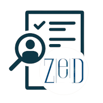

# Zero Knowledge Discovery Lab — Skill Tests

  

This repository hosts **screening tasks** used to assess the minimum technical background for roles in the **Zero Knowledge Discovery Laboratory** ([zed.createuky.net](https://zed.createuky.net/)). 

+ Level 0: Undergraduate Researcher
+ Level 1: Graduate and Postdoctoral Associate

## Screening Tasks
- **Level 0:** Basic data handling & visualization — [`level_0_screening.md`](./level_0_screening.md)
- **Level 1:** QuasiNet / LSM sequence modeling — [`level_1_screening.md`](./level_1_screening.md)

## Submission
Email your deliverables per the task instructions to **ishanu_ch@uky.edu**.

## Use of AI in Coding
Allowed, as long as  you can  demonstrate the skill being tested.

